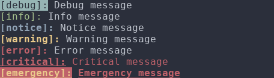
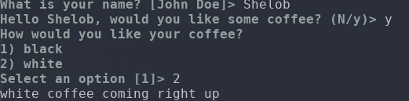

# Shelob

A collection of utilities for Bash 3.1+

[](https://travis-ci.org/pearl-packs/shelob)

<!-- toc -->

- [Utilities](#utilities)
  * [Colors](#colors)
    + [Environment variables for colors](#environment-variables-for-colors)
  * [Logger](#logger)
    + [Environment variables for logger](#environment-variables-for-logger)
  * [Magic Vars](#magic-vars)
  * [Interactive](#interactive)
    + [Environment variables for interactive](#environment-variables-for-interactive)
- [Installation](#installation)
  * [Install via Pearl](#install-via-pearl)
  * [Install using bpkg](#install-using-bpkg)
  * [Clone source](#clone-source)
  * [Download and start using:](#download-and-start-using)
- [References](#references)

<!-- tocstop -->

## Utilities

### Colors
[Source shelob-colors<span>.</span>sh](#installation) to use available color functions:


```bash
#!/usr/bin/env bash
echo "Hello" | red
echo "Hello" | red underline
echo "Hello" | black green_bg bold
```

will produce. 


All formatting functions can be chained as above.

Available formatting options are as follows

**foreground colors**
- black
- red
- green
- yellow
- blue
- magenta
- cyan
- white

**backgroundcolors**
- black_bg
- red_bg
- green_bg
- yellow_bg
- blue_bg
- magenta_bg
- cyan_bg
- white_bg

**styles**
- bold
- underline


Colors are printed automatically depending on current output. If current output is a tty the functions will output the colors.

Redirection and further piping will disable the colors. The following will not output any colors.

```bash
printf "%s" "This will not output any colors" | blue > a.out
```

#### Environment variables for colors
| Variable      | Options             | Description |
| ---------     | -------             | ----------- |
| SHELOB_COLOR  | auto\|always\|never | Default is `auto`. To enable colors even when output is not tty set value to `always`. Set `never` to disable |


### Logger


Logging supports colors and is compatible with [Syslog Severity levels](https://en.wikipedia.org/wiki/Syslog#Severity_levels).

[Source shelob-logger<span>.</span>sh](#installation) to use available logging functions:

```bash
#!/usr/bin/env bash

source lib/shelob-logger.sh

SHELOB_LOG_LEVEL=7
debug "Debug message" #SHELOB_LOG_LEVEL=7
info "Info message" #SHELOB_LOG_LEVEL=6
notice "Notice message" #SHELOB_LOG_LEVEL=5
warning "Warning message" #SHELOB_LOG_LEVEL=4
error "Error message" #SHELOB_LOG_LEVEL=3
critical  "Critical message" #SHELOB_LOG_LEVEL=2
emergency "Emergency message" #SHELOB_LOG_LEVEL=1
```

will output:



Colors are disabled if output is not tty.

Be careful when using emergency as it will exit the program with the exit value 1

#### Environment variables for logger

| Variable              | Options       | Description      |
| -----                 | ----------    | ---------        |
| SHELOB_LOG_TIMESTAMP  | true\|false    | Default=false. Set `true` to output timestamp with log messages. |
| SHELOB_COLOR  | auto\|always\|never | Default is `auto`. To enable colors even when output is not tty set value to `always`. Set `never` to disable. Note that this will affect [ color ](#colors) functions as well. |
| SHELOB_LOG_LEVEL      | 1\|2\|3\|4\|5\|6\|7              | Default is 6 (only disables debug messages). When log level is set to a number, all logs at smaller levels will also be enabled. e.g. to only see `error` level messages and messages at lower level (critical, emergency) set SHELOB_LOG_LEVEL to 3 |


### Magic Vars

[Source shelob-magicvars<span>.</span>sh](#installation) to use magic variables. 

Magic variables automatically resolves directory name, file name with full path, and base name of currenly sourced or executed file. Consider following example:

file<span>.</span>sh uses shelob-magicvars to resolve and output file information. 

```bash
#!/usr/bin/env bash
# file.sh
source "$SHELOB_HOME/lib/shelob-magicvars.sh"

echo "Directory is $__dir"
echo "File path is $__file"
echo "File name is $__base"
```

Running file<span>.</span>sh will produce following output:

```bash
> ./file.sh

Directory is /home/bren
File path is /home/bren/file.sh
File name is file.sh
```

Magic variables even work when sourcing a file from within another file. In follwing example main<span>.</span>sh sources file<span>.</span>sh shown above in the first example.

```bash
#!/usr/bin/env bash
#main.sh
source "./file.sh"
```
will output following:

```bash
> ./main.sh

Directory is /home/bren
File path is /home/bren/file.sh
File name is file.sh
```

Magic variables work even if file.sh is sourced or run through a symbolic link.


### Interactive

A collection of functions to get input from user interactively. 

[Source shelob-interactive<span>.</span>sh](#installation) to use available functions:

Check out following example:

```bash
#!/usr/bin/env bash

source lib/shelob-interactive.sh

#First argument is the variable the input will be assigned to
#Third argument is the default value. If user hits enter it will use default value.
ask_input name "What is your name?" "John Doe"

# Ask a yes no question to user.The function is meant to be used with
# conditional statements.
# Default value is the third argument, if not provided default answer will
# be assumed to be "Yes".
# Accepted values are Y y n N, any other value will set default value as Yes
# and print a warning message denoting this.
if ask_yes_no "Hello $name, would you like some coffee?" "n"; then
  # Ask user to chose an option.
  # First argument is the variable the answer will be assigned to.
  # Third argument is a list of comma separated options
  # Fourth argument is the default anser(number of the option in the list starting from 1)
  ask_option answer "How would you like your coffee?" "black,white" 1
  echo "$answer coffee coming right up"
else
  # Same as ask_input, except input is required.If no default value is provided
  # and user does not input anything it will ask again
  ask_input_required reason "Okay then, why not?"
  echo "Really? \"$reason\" is not a valid reason to turn down a cup of coffee"

fi
```

will produce following output:



#### Environment variables for interactive

| Variable                  | Options        | Description        |
| ------------------------- | -------------- | ------------------ |
| SHELOB_ANSWER_ALL         | true\|false     | Default is false. Set to true if it is meant to be used in a non-interactive manner. If set to true user will not be prompted and default answers will be used.Useful for non-interactive scripts. |

## Installation

You can install Shelob in a couple different ways:

### Install via Pearl
-  To install Shelob via [Pearl](https://github.com/pearl-core/pearl). Add following line to pearl.conf

    ```sh
    PEARL_REPOS+=("https://github.com/pearl-packs/repo.git")
    ```

    You can use following one liner if you installed Pearl with defaults:
    ```bash
    echo "PEARL_REPOS+=("https://github.com/pearl-packs/repo.git")" >> .config/pearl/pearl.conf
    ```

- Then run `pearl install shelob`

  `SHELOB_HOME` will be set automatically when you open a new terminal. You can source utilities using this variable. e.g. :

  ```bash
  source "$SHELOB_HOME/lib/shelob-colors.sh"
  ```

- Uninstall:
  
  ```bash
  pearl remove shelob
  ```

### Install using bpkg
- Run following command to install using [bpkg](https://github.com/bpkg/bpkg)

    `sudo bpkg install -g pearl-packs/shelob`

    This will install Shelob utilities under /usr/local/lib.

    You can source any utility file as follows

    ```bash
    source "/usr/local/lib/shelob-logger.sh"
    ```

- If you don't have root permissions or just want to install to another location set PREFIX as the path you want to install shelob to:

    ```bash
    PREFIX="/path/to/install" bpkg install -g pearl-packs/shelob
    ```
- Unfortunately installing Shelob as a dependency does not work at the moment due to [a bug](https://github.com/bpkg/bpkg/issues/82) in bpkg.

### Clone source
- You can just the clone the source and start using.

```
git clone https://github.com/pearl-packs/shelob
```

### Download and start using:

- Utility files are independent from each other as they are all bundled separately and can be used without the need of downloading the whole thing. If you only need logger you can just grab it and start using. 

    Download using wget:

    ```bash
    wget https://raw.githubusercontent.com/pearl-packs/shelob/master/lib/shelob-logger.sh
    ```

## References

All thanks to following.I cobbled together scripts and used ideas from these awesome sources and projects:

- [Bash package panager](https://github.com/bpkg/bpkg/)
- [Bash3 Boilerplate](http://bash3boilerplate.sh/)
- [Shell Script Loader](https://loader.sourceforge.io)
- [Pearl](https://github.com/pearl-core/pearl)
- And of course folks contirbuting to [Stackoverflow](https://stackoverflow.com/)
